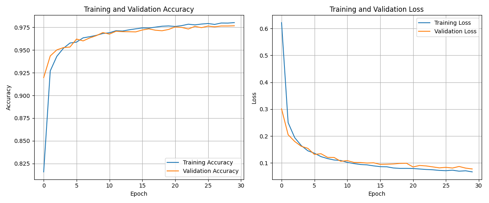

# MNIST-Digit-Recognizer-with-TensorFlow-and-Tkinter

Here's a comprehensive README.md file for your GitHub repository:

A desktop application that recognizes handwritten digits using a trained TensorFlow/Keras model with a user-friendly Tkinter GUI.

## Features

- Interactive drawing canvas for digit input
- Real-time digit prediction using a trained CNN model
- Visual probability distribution of predictions
- Adjustable brush size
- Save drawn digits as images
- Clean, responsive UI with proper taskbar integration

## Requirements

- Python 3.8+
- TensorFlow 2.x
- Keras
- NumPy
- Matplotlib
- Pillow (PIL)
- Tkinter (usually comes with Python)

## Installation

1. Clone the repository:
   ```bash
   git clone https://github.com/yourusername/mnist-digit-recognizer.git
   cd mnist-digit-recognizer
   ```

2. Create and activate a virtual environment (recommended):
   ```bash
   python -m venv venv
   source venv/bin/activate  # On Windows: venv\Scripts\activate
   ```

3. Install dependencies:
   ```bash
   pip install -r requirements.txt
   ```
   - TensorFlow/Keras: Core ML framework for the digit recognition model
   - NumPy: Required for numerical operations (used by TensorFlow)
   - Matplotlib: For displaying the prediction probability chart
   - Pillow (PIL): For image processing and handling
   - SciPy: Often required as a dependency for scientific computing
   - PyInstaller: For building the executable (optional for development)

## Usage

### Running the Application
```bash
python digit_predictor.py
```

### How to Use
1. Draw a digit (0-9) in the canvas area
2. Click "Predict Digit" to see the recognition results
3. Adjust brush size using the slider if needed
4. Use "Clear Canvas" to start over
5. Save your drawing with "Save Image"

## Building the Executable

To build a standalone executable:

1. Install PyInstaller:
   ```bash
   pip install pyinstaller
   ```

2. Build using the provided spec file:
   ```bash
   pyinstaller --clean --noconfirm digit_predictor.spec
   ```

3. The executable will be in the `dist` folder

Note: The executable will be large (~200-300MB) due to TensorFlow dependencies.

## File Structure

```
mnist-digit-recognizer/
├── digit_predictor.py       # Main application code
├── digit_predictor.spec     # PyInstaller configuration
├── best_model.keras         # Trained model (not included in repo)
├── digit_icon.ico           # Application icon
├── requirements.txt         # Python dependencies
├── README.md                # This file
└── saved_digits/            # Folder for saved digit images
```

## Model Information

The application uses a pre-trained convolutional neural network (CNN) model trained on the MNIST dataset. The model architecture is:

- Input: 28x28 grayscale images
- Conv2D (32 filters, 3x3 kernel, ReLU activation)
- MaxPooling2D (2x2 pool size)
- Conv2D (64 filters, 3x3 kernel, ReLU activation)
- MaxPooling2D (2x2 pool size)
- Flatten
- Dense (128 units, ReLU activation)
- Dropout (0.5 rate)
- Output (10 units, softmax activation)

Achieves ~99% accuracy on the MNIST test set.

## Troubleshooting

**Problem:** TensorFlow import errors when building executable  
**Solution:** Make sure you're using the latest PyInstaller and TensorFlow versions. The provided `.spec` file includes all necessary hidden imports.

**Problem:** Application icon not showing in taskbar  
**Solution:** Ensure you have a proper `.ico` file and it's correctly referenced in both the Python code and `.spec` file.

**Problem:** Large executable size  
**Solution:** This is expected with TensorFlow applications. Consider using UPX compression (included in the `.spec` file).

## Demo-time

1. App


2. User interface (HOME)


3. Some digit recognition tasks


4. About page


5. Out of the drawing boundary


6. Save


7. Unknown entry


8. Training plot



## Contributing

Contributions are welcome! Please open an issue or submit a pull request.

## License

MIT License - see [LICENSE](LICENSE) file for details

---

Developed by Amanuel Mihiret - zeaman48@gmail.com - https://www.youtube.com/@YomTech44
```
